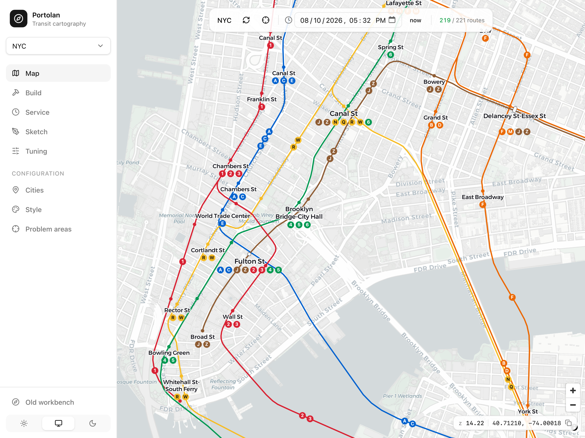
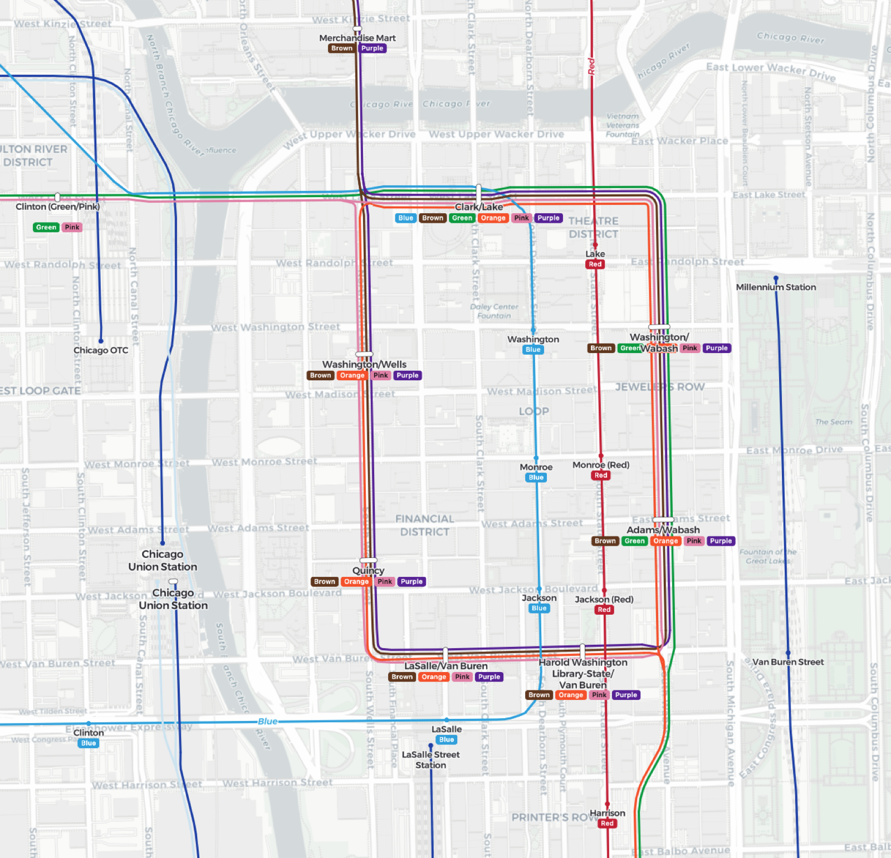

# Portolan

**Transit maps that draw themselves.**

Give Portolan a city's published schedule data and it builds a transit map. Each
line gets its own colour. Lines that share a track run side by side at an even
spacing, then split apart at junctions. Stations are named and labelled with the
routes that call there. No mapmaker is involved at any step.



*Lower Manhattan, built automatically from the MTA's public feed.*

---

## What this is

Every transit agency publishes its schedule as a **GTFS feed**: a zip file of
spreadsheets listing routes, stops, and the rough path each train takes. It is
built for trip planners, not for looking at. If you draw a GTFS feed straight
onto a map you get a tangle, because fifteen lines sit on top of each other
along the same corridor and only the last one drawn is visible.

Real transit maps solve this by hand. A mapmaker decides that the 4, 5 and 6
share a trunk down Lexington Avenue, draws them as three parallel bands at a
steady spacing, and works out how each one leaves the group at 125th Street.
That work takes weeks, and it is out of date as soon as the network changes.

Portolan does the same job automatically.

- **Input:** a GTFS feed, plus rail and street geometry from OpenStreetMap.
- **Output:** map geometry in which shared corridors become parallel bands. They
  hold an even spacing at every zoom level, split and join with smooth curves at
  junctions, and follow the real path of the tracks.
- **Speed:** a full city rebuilds in seconds, so you can change something and see
  the result right away.

The name comes from the portolan chart, a medieval sea map made of hand-drawn
lines between harbours. Those charts were drawn by people who cared that every
line landed exactly where a sailor needed it. That is the standard here:
automatic output that looks hand-drawn.

## What makes it hard

The hard part is not drawing lines. It is working out **which lines belong
together, and in what order**.

1. **Where does the track actually go?** A GTFS feed gives one rough, wobbly
   path per route. The real tracks are in OpenStreetMap. Portolan matches the
   first to the second, so lines sit on real track instead of floating between
   tracks.

2. **Which tracks form one corridor?** Two tracks that stay parallel over a long
   run belong to the same corridor and share one centre line. Two tracks that
   simply cross do not. Telling these apart is most of the work.

3. **What order do the bands go in?** Once six routes share a corridor they need
   an order, and it has to be chosen so that lines do not cross over each other
   for no reason when the corridor splits at the next junction. This is a known
   hard problem, so Portolan uses a practical estimate rather than an exact
   solve.

4. **How does a fork become a drawing?** At a junction a band has to leave the
   group and curve away smoothly, and the gap it leaves behind has to close up
   cleanly, at every zoom level.

All of this is done as exact vector geometry. There is no raster step and no
pass that draws first and patches the result afterwards. The details are in
[docs/ALGORITHM.md](docs/ALGORITHM.md).



*Chicago's Loop is the hardest test case. Five services run around one elevated
circuit, hold their spacing and their order the whole way round, then leave the
group one at a time. Built from the CTA feed with no manual work.*

## Try it

```bash
go run ./cmd/portolan atlas   # the workbench, at http://127.0.0.1:8765
```

The workbench, shown in the first screenshot, is the main way to use Portolan.
It has a city picker, a live map, a rebuild button that runs the pipeline and
reloads the map when it finishes, a time-of-day slider that shows which routes
are running at a given hour, a drawing tool for reference networks, and a panel
of tuning controls.

To build a city from the command line instead:

```bash
go run ./cmd/portolan chart --gtfs nyc.zip --rail testdata/nyc-rail.geojson --out nyc.geojson
```

You supply the GTFS zip, which agencies publish freely. The OpenStreetMap track
extract takes one command:

```bash
tools/city.sh rail london
```

`make cities` lists every city that is set up and shows which of its inputs you
already have. `make city CITY=london` builds and scores one city.

Cities are configured in `portolan.json`, one entry each, and nothing more.
There is no city-specific code anywhere in the repo. Seventeen cities are set up
(New York, Chicago, London, Paris, Berlin, Tokyo, Los Angeles, Atlanta,
Charlotte, Washington DC, Mexico City, Amsterdam, Barcelona, Boston, Toronto,
Vienna and Santiago), and each one keeps the others honest. See
[docs/CITIES.md](docs/CITIES.md) for how to add your own.

## What it draws

Every rail mode is supported: subway, light rail, tram and commuter rail. So are
ferries and aerial modes such as gondolas and funiculars. Ferries need no track
data at all, because the published route shape is the geometry. Routes group
into bands by colour where the agency publishes one, and by operator where it
does not.

Stations are grouped using the feed's own transfer data, so a complex such as
Fulton Street reads as one station with one label and the full set of route
markers, rather than five separate dots.

Buses are designed but not started. They need a street corridor model rather
than a track model. See [docs/MODES.md](docs/MODES.md).

## Accuracy

Portolan ships with a scorer. `testdata/sketches/nyc.json` is a New York network
drawn by hand in the workbench, 15 lines and 88.6 km, and it is treated as the
definition of correct. Every change to the geometry has to pass it:

```
$ portolan sound --network testdata/sketches/nyc.json --build nyc.geojson
jaggedness: max turn 23°, 0 spikes · wobble p90 5.6 m
fwd mean 1.8 m, p90 3.6 m · 0 self-intersections · PASS
```

That is a mean distance of under two metres from where a person drew the same
line, on a build that takes about eight seconds. An earlier Python version of
this project reached 2.6 m with a visible kink, and took four minutes per build.

**Current status:** the full pipeline works and passes every check on New York
and Chicago. Known weak spots: the busiest junction interiors, such as the City
Hall loop, still show artefacts; where OpenStreetMap has no track data the line
falls back to the rough feed shape; and corridor ordering is a local estimate
rather than an exact solve.

## Reading further

| doc | what is in it |
|---|---|
| [ALGORITHM.md](docs/ALGORITHM.md) | how the pipeline works, stage by stage |
| [BUNDLING.md](docs/BUNDLING.md), [CENTERLINE.md](docs/CENTERLINE.md) | the corridor detection core, in detail |
| [CITIES.md](docs/CITIES.md) | adding a city, feed sources, per-city status |
| [MODES.md](docs/MODES.md) | how each transit mode is drawn, and the plan for buses |
| [STOP-LABELS.md](docs/STOP-LABELS.md) | station grouping, labels and route markers |
| [SERVICE-SCENARIOS.md](docs/SERVICE-SCENARIOS.md) | time-of-day maps, such as what runs at 3am |
| [TOOLS.md](docs/TOOLS.md) | the workbench, the scorer and its checks |
| [LESSONS.md](docs/LESSONS.md) | two earlier attempts and why they were dropped |

Portolan is written in Go for build and run speed. The whole repo compiles in
under a second and a city build finishes in single-digit seconds, which keeps
the edit, rebuild and review loop tight.

Even spacing across a continuous zoom range needs a MapLibre build with variable
line offsets. Point the workbench at it with `--maplibre <dist-dir>`. Rendering
with fixed, pre-baked offsets works with stock MapLibre.

## Thanks

Portolan stands on work by other people.

- **[Transit](https://blog.transitapp.com/how-we-built-the-worlds-prettiest-auto-generated-transit-maps-12d0c6fa502f/)**,
  for showing that auto-generated maps can be beautiful, and for writing up how
  they did it. Their post *A Technical Follow-Up: How We Built the World's
  Prettiest Auto-Generated Transit Maps* is where the idea of cutting junctions
  out and reconnecting the lines with smooth curves comes from. Portolan uses
  that approach.

- **Hannah Bast, Patrick Brosi and Sabine Storandt** at the University of
  Freiburg, for [LOOM](https://github.com/ad-freiburg/loom) and the paper
  [*Efficient Generation of Geographically Accurate Transit
  Maps*](https://arxiv.org/abs/1710.02226) (SIGSPATIAL 2018). They defined and
  solved the line ordering problem: choosing the order of routes along a shared
  corridor so that the fewest lines cross. Portolan's ordering step is a lighter,
  faster estimate of what LOOM solves exactly.
  [pfaedle](https://github.com/ad-freiburg/pfaedle), from the same group, is used
  here to rebuild feed shapes that are too coarse to match against track.

- **[Transitland](https://www.transit.land)**, run by Interline, for the slow
  and unglamorous work of collecting the world's transit feeds in one place and
  keeping them current. Finding, checking and tracking a feed per agency is a
  real cost, and Transitland removes most of it. Nearly every city set up here
  is keyed by its Transitland feed id, so adding a city is usually a search and
  a download rather than a hunt.

- **Apple Maps**, for setting the standard. Its transit layer, and the Chicago
  Loop in particular, is the reference this project measures itself against:
  clean parallel lines that hold together while you zoom.

Above all, thanks to the agencies that publish open schedule data and to
[OpenStreetMap](https://www.openstreetmap.org) contributors, who map the track
itself. Without both, none of this would be possible.
